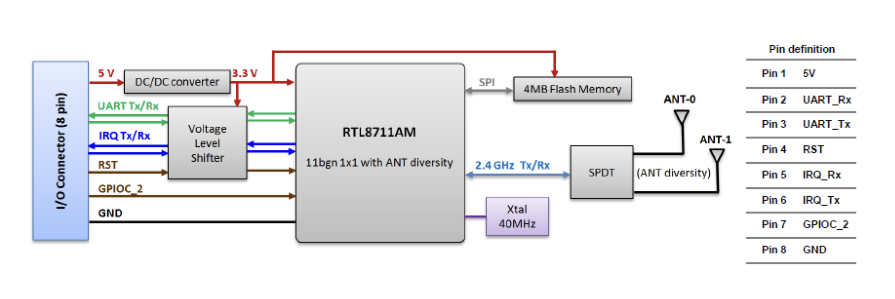

# ESPHome Panasonic PACi UART Component

> **Scope: Panasonic PACi only.** This component targets Panasonic **PACi**
> commercial/semi-commercial air conditioners (CZ-RTC controller bus, DNSK-P11/CN-WLAN/CN-CNT
> style UART). It is **not** compatible with Panasonic Etherea/residential splits, Aquarea,
> or VRF/ME systems — those use different protocols.

ESPHome climate component for Panasonic **PACi** air conditioners using the wired UART bus used by Panasonic wall controllers and WLAN/controller modules.

This component is developed and tested against:

- Indoor unit: `S-100PF1E5A`
- Outdoor unit: `U-100PEY1E5`
- Bus: Panasonic PACi wired UART controller/WLAN bus

The current implementation target is the `wlan` backend only. The name is historical; this is a wired UART protocol implementation, not a Wi-Fi cloud integration.

## Status

The protocol implementation is based on logic-analyzer captures from the target system.

Implemented protocol support:

- UART transport with framing, logging, and XOR checksum validation
- Status parsing (power, mode, fan, target/current temperature)
- Power control
- Mode control (heat, cool, dry, fan only, auto)
- Target temperature control
- Fan speed control
- Eco/powersave control (exposed both as a switch and as an Eco climate preset)
- Outdoor-unit reported temperature (extended `EF/21` query)
- Selected service/admin settings read/write (exposed as selects)

## Supported Hardware

Panasonic **PACi** systems only.

Tested target:

- Indoor unit: `S-100PF1E5A`
- Outdoor unit: `U-100PEY1E5`

Other Panasonic PACi units likely use a similar protocol, but they are not confirmed.
Non-PACi Panasonic products (Etherea/residential splits, Aquarea, VRF/ME) are not supported.

## Hardware / Wiring

This component needs access to the Panasonic PACi WLAN-module UART interface.

This is the same interface used by the original Panasonic **DNSK-P11** Wi-Fi module.

On Panasonic boards/adaptors this connector may be labelled **CN-WLAN**. In this documentation it is referred to as the **CN-WLAN / DNSK-P11 host connector**.

The PACi-to-CN-WLAN bridge/interface may already be provided by existing hardware, such as the Panasonic **CZ-CAPWFC1** adaptor or some proprietary Intesis-based installations.



A convenient hardware reference is the **P11** board by Ingenious Makers:

```text
https://www.ingeniousmakers.com/p11
```

The target setup used for development is an ESP32-C3 connected to the PACi UART bus with:

- TX: GPIO21
- RX: GPIO20
- UART: 2400 baud, 8 data bits, even parity, 1 stop bit

Important wiring/protocol rule:

- The ESP component transmits as source `0xE0` only.
- The wired wall controller uses source `0x40`; this component only listens to `0x40` frames and never transmits as `0x40`.

Check the P11 hardware documentation and your unit's service documentation before connecting anything to the indoor unit bus.

## UART Settings

The observed bus uses:

```yaml
uart:
  baud_rate: 2400
  data_bits: 8
  parity: EVEN
  stop_bits: 1
```

The protocol uses XOR checksums:

```text
checksum = XOR of all bytes before the checksum byte
XOR(full frame including checksum) == 0x00
```

## Protocol Notes

See [`PROTOCOL.md`](PROTOCOL.md) for the detailed reverse-engineering notes, frame
examples, parser notes, admin transactions, and known open questions.


The PACi bus observed on the target unit uses `E0`, `40`, and `00` frame families.
The first byte of a frame is the source address:

- `E0` — this WLAN/controller adapter (every frame **this component sends** uses `E0`).
- `40` — the wired wall remote controller (`0x20 << 1`). Frames starting with `40`
  are the **real wired remote** talking on the bus; this component only listens to
  them, it never transmits as `40`.
- `00` — event/broadcast frames and most responses, including `00 E0 ...` responses
  to this component's reads and `00 40 ...` responses to the wired controller.

So when a capture shows the same command from both `40 ...` and `E0 ...`, the `40`
version is the wired remote and the `E0` version is this component. The examples below
use the `E0` source that this component actually sends.

Common write frame format:

```text
[0] [1] [2] [LEN] [PAYLOAD len bytes] [XOR]
```

Examples:

```text
E0 00 11 03 08 41 83 38          # power on
E0 00 11 03 08 42 02 BA          # cool mode
E0 00 11 05 08 4C 0A 1A 76 D6    # cool target 24.0°C
```

## Basic Command Map

### Power

```text
OFF = E0 00 11 03 08 41 82 39
ON  = E0 00 11 03 08 41 83 38
```

### Modes

```text
HEAT     = E0 00 11 03 08 42 01 B9
COOL     = E0 00 11 03 08 42 02 BA
FAN_ONLY = E0 00 11 03 08 42 03 BB
DRY      = E0 00 11 03 08 42 04 BC
AUTO     = E0 00 11 03 08 42 05 BD
```

### Target Temperature

Temperature encoding:

```text
raw = °C * 2 + 0x46
°C = (raw - 0x46) / 2
```

Cool:

```text
E0 00 11 05 08 4C 0A 1A TT CS
```

Heat:

```text
E0 00 11 05 08 4C 09 2A TT CS
```

Dry:

```text
E0 00 11 05 08 4C 0C 1A TT CS
```

Auto / heat-cool auto mode writes the target into several auto slots (`0D`, `15`, `0E`)
with kind `1D`; this is derived from PACi captures from the target unit.

### Fan Speed

Fan writes are mode-specific on the target PACi unit. The speed byte is:

```text
AUTO   = 1A
HIGH   = 1B
MEDIUM = 1C
LOW    = 1D
```

Mode-specific slots:

```text
HEAT     = E0 00 11 05 08 4C 11 FF 00 00 CS
COOL     = E0 00 11 05 08 4C 12 FF TT CS
FAN_ONLY = E0 00 11 05 08 4C 13 FF 00 00 CS
DRY      = E0 00 11 05 08 4C 14 FF 00 00 CS
AUTO     = E0 00 11 05 08 4C 15 FF 00 00 CS
```

`FF` is the fan speed byte. `TT` is the current target temperature raw value and is used
by the cool-mode fan slot.

### Eco / Powersave

```text
OFF = E0 00 11 03 08 54 09 A7
ON  = E0 00 11 03 08 54 0B A5
```

### Outdoor temperature

Outdoor temperature is read from the extended `EF/21` query:

```text
E0 00 17 07 08 80 EF 00 21 00 20 96
```

The response value is parsed as big-endian tenths of °C:

```text
00 E0/40 1A 07 80 EF 80 00 21 HH LL CS
temperature = ((HH << 8) | LL) / 10.0
```

The `0F` status block contains temperature-looking bytes but is **not** the
authoritative outdoor-temperature source.

## Status Parsing

Main status frames contain an `80 81` payload.

Observed shape:

```text
80 81 S0 S1 S2 S3 TT CT X1 X2 PS
```

Known fields:

```text
power = S0 & 0x01
mode  = (S0 >> 5) & 0x07
fan   = (S1 >> 5) & 0x07

target_temperature = (TT - 0x46) / 2
current_temperature = (CT - 0x46) / 2
powersave = PS
```

Known mode values:

```text
1 = heat
2 = cool
3 = fan_only
4 = dry
5 = auto
```

Known fan values:

```text
2 = auto
3 = high
4 = medium
5 = low
```

Current temperature and powersave status are parsed from confirmed target-unit captures.

## Service/Admin Settings

The service/admin settings namespace appears to be:

```text
08 07
```

Read setting (`KK` = code; `CS` = XOR over the preceding bytes):

```text
E0 00 15 04 08 07 00 KK CS      # e.g. read code 31: E0 00 15 04 08 07 00 31 CF
```

Write setting (`KK` = code, `VV` = value):

```text
E0 00 11 04 08 07 KK VV CS      # e.g. set 33=00 (°C): E0 00 11 04 08 07 33 00 C9
```

Confirmed PACi service/admin settings:

| Code | Meaning | `00` | `01` |
|---:|---|---|---|
| `31` | Ventilation fan output setting | Not connected | Connected |
| `32` | Room temperature sensor | Main unit | Remote controller |
| `33` | Temperature display setting | °C | °F |

These three settings are exposed in Home Assistant as `select` entities. After a write,
the component reads the value back from the bus to confirm the change actually applied;
an ACK alone only means the bus saw the command.

Arbitrary service/admin writes should not be exposed until the specific PACi code and value encoding are confirmed.

## Example ESPHome Configuration

Minimal configuration:

```yaml
external_components:
  source: github://rndm2/esphome_panasonic_paci
  components: [panasonic_paci]

uart:
  id: ac_uart
  tx_pin: GPIO21
  rx_pin: GPIO20
  baud_rate: 2400
  data_bits: 8
  parity: EVEN
  stop_bits: 1

climate:
  - platform: panasonic_paci
    type: wlan
    name: "Panasonic AC"
```

Full configuration with the optional entities:

```yaml
climate:
  - platform: panasonic_paci
    type: wlan
    name: "Panasonic AC"

    # Eco/powersave. Also available as the "Eco" climate preset.
    eco_switch:
      name: "Panasonic AC Eco"

    # Service/admin settings (HA select entities).
    ventilation_output_select:
      name: "Panasonic AC Ventilation Output"
    remote_temperature_sensor_select:
      name: "Panasonic AC Room Sensor Source"
    temperature_unit_select:
      name: "Panasonic AC Display Unit"

    # Optional diagnostic sensors.
    target_temperature_sensor:
      name: "Panasonic AC Target Temperature"
    current_temperature_sensor:
      name: "Panasonic AC Current Temperature"
    outdoor_temperature:
      name: "Panasonic AC Outdoor Temperature"

    # Unit identity, read from the bus.
    indoor_model:
      name: "Panasonic AC Indoor Model"
    indoor_serial:
      name: "Panasonic AC Indoor Serial"
    outdoor_model:
      name: "Panasonic AC Outdoor Model"
    outdoor_serial:
      name: "Panasonic AC Outdoor Serial"
```

## License

MIT License.